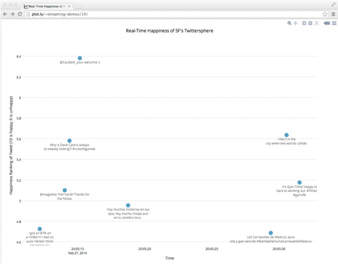

## Plotly's Real-Time Streaming API


#### This is an example of a real-time plotly graph: [http://plot.ly/~streaming-demos/6/](http://plot.ly/~streaming-demos/6/)

- You and I see the same data, updating at the same time. Try this: open up a streaming plot in two different browser windows.

- Plotly streaming graphs are immediately shareable -- by shortlink or as embedded in website or an IPython notebook

- Owners of plotly graphs can edit their with the plotly web-app. All of the viewers of the graph will see the changes update live

- It's fast: graphs update up to 20 times / second.

This repo contains several examples for working with the Plotly streaming API. All of the examples are running in real-time on a remote server. View the IPython notebooks in nbviewer here: [nbviewer.ipython.org/github/plotly/Streaming-Demos](nbviewer.ipython.org/github/plotly/Streaming-Demos)

Questions? Suggestions? Made a sweet real-time graph? Get in touch at <ben@plot.ly> or [@plotlygraphs](https://twitter.com/plotlygraphs)!

See the individual folders for detailed documentation.

## Examples

#### Plotly's Python API

Examples of Plotly's Streaming API together with Plotly's [Python API](https://github.com/plotly/python-api) in
the [User Guide](http://nbviewer.ipython.org/github/plotly/python-user-guide/blob/master/s00_homepage/s00_homepage.ipynb).

The example IPython notebooks in the User Guide are up-to-date with the latest
version of Plotly's Python API (version 1.0.\*), unlike the examples in the `IPython examples`
folder of this repository.

#### Graphing Real-time Sensor Data
[](http://plot.ly/~streaming-demos/6)

The live graph, running from a Node server: [https://plot.ly/~streaming-demos/6/](https://plot.ly/~streaming-demos/6/). View the code in the Node folder in this repo.

The live graph, running from an IPython server: [https://plot.ly/~streaming-demos/12/](https://plot.ly/~streaming-demos/12/). View the code in the IPython folder in this repo.

#### Embedded systems
##### Our real-time heart rate monitor (click to view the video):
<p align="center">
<a href="https://vine.co/v/Mq2LQexrbl7">

</a>
</p>

The Arduino Yún library is here: [https://github.com/plotly/arduino-api/tree/master/plotly_yun](https://github.com/plotly/arduino-api/tree/master/plotly_yun)

##### Raspbery Pi
Example code with the Plotly-Python library: [https://github.com/plotly/raspberrypi](https://github.com/plotly/raspberrypi)


#### Graphing the Real-time Twitter Stream
[](https://plot.ly/~streaming-demos/14/)

Implemented in Node, example code is in this repo.

#### Plotting Simulations
[](https://plot.ly/~streaming-demos/4/)

View the live, never-ending double pendulum simulation graph in our IPython notebook here: [http://nbviewer.ipython.org/github/plotly/Streaming-Demos/blob/master/IPython%20examples/Simulation%20-%20Double%20Pendulum.ipynb](http://nbviewer.ipython.org/github/plotly/Streaming-Demos/blob/master/IPython%20examples/Simulation%20-%20Double%20Pendulum.ipynb)

#### Animations
[](https://plot.ly/~streaming-demos/3/)

View the live, forever-repeating Hans Rosling bubble chart graph in an IPython notebook here: [http://nbviewer.ipython.org/github/plotly/Streaming-Demos/blob/master/IPython%20examples/Animation%20-%20Gapminder%20Bubble%20Charts.ipynb](http://nbviewer.ipython.org/github/plotly/Streaming-Demos/blob/master/IPython%20examples/Animation%20-%20Gapminder%20Bubble%20Charts.ipynb)


## Basic streaming concepts

Streaming has been added as an additional API layer on top of our [static graph API](http://plot.ly/api/). Therefore you follow the steps for making an API call to our plotting server and once confirmation is given proceed to stream data to the given address. Here is a little node.js demo:
```javascript
Plotly = require("plotly")
data = {
    'x':[]
  , 'y':[]
  , 'type':'scatter'
  , 'mode':'lines'
  , stream: {
    "token": token
  }
}
plotly.plot(data, un, key, layout)
})
```
That should give you a response which will look something like
```bash
stream-host: 'http://stream.plot.ly',
stream-status: 'All Streams Go!',
url: 'https://plot.ly/~BenPostlethwaite/0',
filename: 'streamsAGoGO',
message: 'High five! You successfuly sent some data to your account on plotly.
View your plot in your browser at https://plot.ly/~BenPostlethwaite/0
or inside your plot.ly account where it is named "streamsAGoGo"'
```
All Streams Go! So now the streaming cluster has been initialized with your information and the streaming token has been configured to a particular data object. The return message shows us the sharable plot URL where we can view our streaming data as well as the address to stream to. So let's start our stream!

```javascript
var hyperquest = require("hyperquest")
var signalStream = require("random-signal")()
var options =  {
    method: 'POST'
  , uri: "http://stream.plot.ly/"
  , headers: {
  , "plotly-streamtoken": token
  }
}
var plotlyStream = hyperquest(options)
signalStream.pipe(req)
```
And that's it!

## Intermediate streaming concepts
- Data **MUST** be sent as newline separated *stringified* JSON. The stream server parses incoming data streams on newlines, so without newlines it will assume a very long single JSON object and eventually just destroy the stream.
```javascript
'{ "x": 3, "y": 1 }\n'
```
- Incoming data should not be written faster than 50ms. We throttle incoming JSON objects at 50ms. While there is a buffer continuing to send data faster than 50ms will result in data loss.
- You can send multiple streams to the same plot by nesting stream tokens within the corrisponding data trace object. Similarly you can use the same token for multiple traces in a plot (they will show the same stream, so this is useful only in when using subplots).

## Advanced streaming concepts
- You must send data every minute otherwise we will consider the stream stale and destroy it. If your data comes in a slower rate send a heartbeat to let the server know it is still active. A heartbeat is simply a newline `"\n"` written within the minute window.

## HTTP Details
Plotly's streaming-API accepts chunked-encoded HTTP posts and allows these connections to be held open indefinitely. Here is an example of a raw HTTP post:

```
POST / HTTP/1.1\r\n
Host: stream.plot.ly\r\n
User-Agent: Python\r\n
Transfer-Encoding: chunked\r\n
Connection: close\r\n
plotly-streamtoken: ab3dk4FBDd\r\n
\r\n
11\r\n
{"y": 1, "x": 1}\n\r\n
11\r\n
{"y": 2, "x": 2}\n\r\n
11\r\n
{"y": 3, "x": 3}\n\r\n
0\r\n
\r\n
```

A few key points:
- An additional header is embedded in the POST: `plotly-streamtoken`
- In HTTP every "chunk" of data (e.g. `{"y": 3, "x": 3}\n`) must be preceded with the length of the chunk in hex. Also, every line is separated by a `\r\n`
- Plotly plots every chunk of data in your browser as soon as it recieves it
- Data can be sent to plotly indefinitely, but we'll close connections if we don't hear anything for 1 minute. You can keep the connection open by sending a heartbeat every minute with a new line: `\n`. Connections are closed with `0\r\n\r\n`

A low-level HTTP example with Python's socket and httlib libraries are in this repo, view it in nbviewer here: [http://nbviewer.ipython.org/github/plotly/Streaming-Demos/tree/master/IPython%20examples/http%20details/](http://nbviewer.ipython.org/github/plotly/Streaming-Demos/tree/master/IPython%20examples/http%20details/)

## Contact Us
Lead Streaming Engineer - ben@plot.ly

Lead API Engineer - chris@plot.ly

twitter [@plotlygraphs](https://twitter.com/plotlygraphs)
