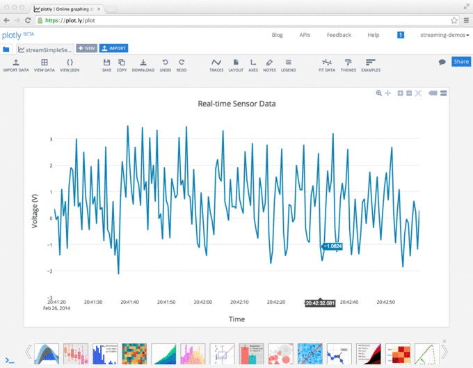
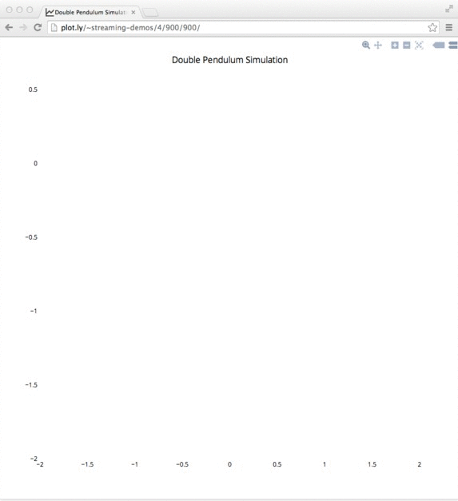
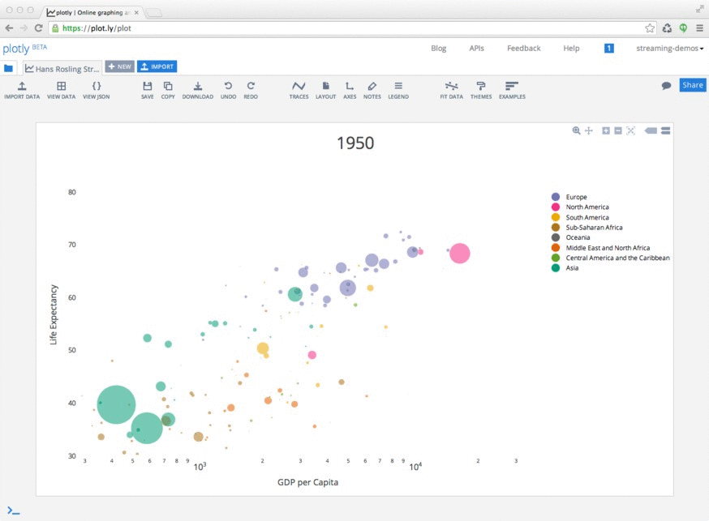

# Plotly streaming examples

## What is Plotly streaming?
[](https://plot.ly/~streaming-demos/6/)


[](https://plot.ly/~streaming-demos/4/)


[](https://plot.ly/~streaming-demos/3/)

1. Take a look at the actual streaming plots for the example .gifs above: [signalstream](), [doublePendulum]() and our take on a [Hans Rosling bubble chart]().
2. This is real-time data, everybody viewing these streaming plots sees the same data at the same time.
3. Stream plots are sharable, embeddable in any website and even in IPython notebooks!
4. If you are the owner of the plot you can head over to the [Plotly app]("https://plot.ly") and style your streaming plot. When you save all the shared plots are live updated to reflect these changes.
5. You can open another users streaming shared plot in the [Plotly app]("https://plot.ly") and make your own styles but saving will result in a static copy (you can't steal someone else's stream).
6. Changing the plot which a stream token is linked to will automatically save the most recent data so viewers of the old plot will at least see a static copy of the most recent data.


This repo contains several examples for working with the Plotly streaming API. There is 1 node.js repo and an IPython notebook example. As it is early days for Plotly's streaming API it should be considered experimental and will likely undergo changes as the feedback + iteration cycle continues. If you have any problems, notice any bugs (you will) or would like to provide us with suggestions you can hit us up at ben@plot.ly or send us a tweet at @plotlygraphs. We fully intend to add more examples to this repo, and if you have a sweet example that you would like us to include here, send a pull request!

See the individual Repos for example specific documentation.


## Basic streaming concepts

Streaming has been added as an additional API layer on top of our [static graph API](http://plot.ly/api/). Therefore you follow the steps for making an API call to our plotting server and once confirmation is given proceed to stream data to the given address. Here is a little node.js demo:
```javascript
Plotly = require("plotly")
data = {
    'x':[]
  , 'y':[]
  , 'type':'scatter'
  , 'mode':'lines'
  , stream: {
    "token": token
  , "maxpoints": 100
  }
}
plotly.plot(data, un, key, layout)
})
```
That should give you a response which will look something like
```bash
stream-host: 'http://stream.plot.ly',
stream-status: 'All Streams Go!',
url: 'https://plot.ly/~BenPostlethwaite/0',
filename: 'mung3',
message: 'High five! You successfuly sent some data to your account on plotly. View your plot in your browser at https://plot.ly/~BenPostlethwaite/0 or inside your plot.ly account where it is named "mung3"'
```
All Streams Go! So now the streaming cluster has been initialized with your information and the streaming token has been configured to a particular data object. The return message shows us the sharable plot URL where we can view our streaming data as well as the address to stream to. So let's start our stream!

```javascript
var hyperquest = require("hyperquest")
var signalStream = require("random-signal")()
var options =  {
    method: 'POST'
  , uri: "http://stream.plot.ly/"
  , headers: {
  , "plotly-streamtoken": token
  }
}
var plotlyStream = hyperquest(options)
signalStream.pipe(req)
```
Okay, super easy? Well, for real-time sharable & embeddable data visualization it sure is easier than all the other alternatives. Check out the example folders in this Repo. If you can do the Node check out `simple-signal-stream` as it will get you up and streaming quickly.

## Intermediate streaming concepts
- Data **MUST** be sent as newline separated JSON. The stream server parses incoming data streams on newlines, so without newlines it will just assume a very long single JSON object and eventually just destroy the stream.
```json
'{ "x": 3, "y": 1 }\n'
```
- Incoming data should not be written faster than 50ms. We throttle incoming JSON objects at 50ms. While there is a buffer continuing to send data faster than 50ms will result in data loss.
- You can send multiple streams to the same plot by nesting stream tokens within the corrisponding data trace object. Similarly you can use the same token for multiple traces in a plot (they will show the same stream, so this is useful only in when using subplots).

## Advanced streaming concepts
- You must send data every minute otherwise we will consider the stream stale and destroy it. If your data comes in a slower rate send a heartbeat to let the server know it is still active. A heartbeat is simply a newline "\n" written within the minute window.

## Contact Us
Lead Streaming Engineer - ben@plot.ly
Lead API Engineer - chrisp@plot.ly
tweet us @plotlygraphs
